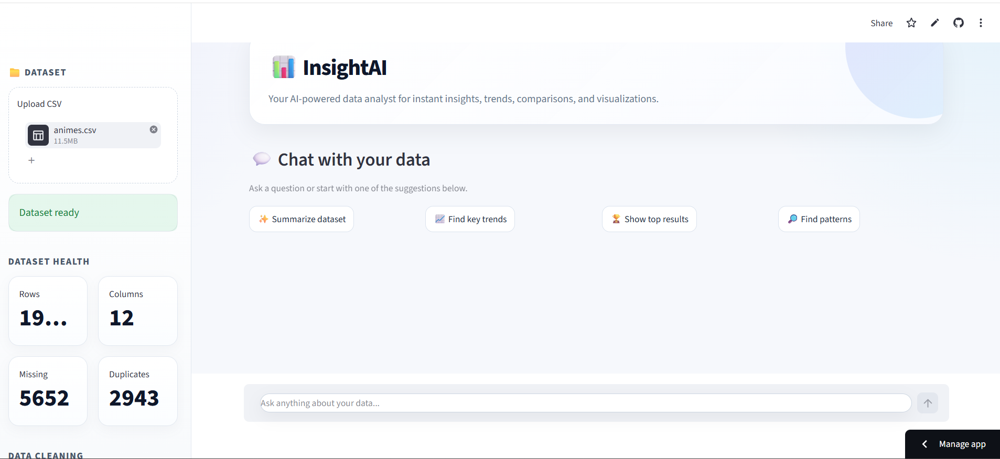
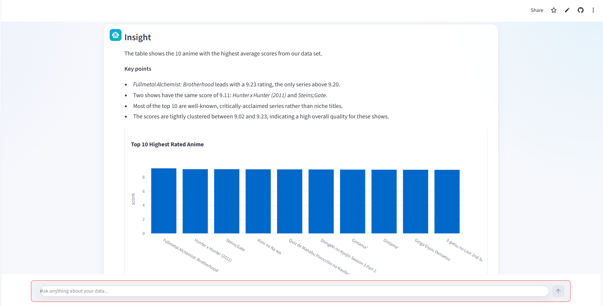

# 📊 InsightAI — AI-Powered Data Analyst Agent

InsightAI is a Generative AI-powered data analytics application that enables users to upload CSV datasets and interact with their data using natural language.

Instead of manually writing Python or Pandas queries, users can ask questions such as:

- "Summarize this dataset and highlight the most important insights."
- "What are the top 10 products by sales?"
- "Show the distribution of customer ages."
- "Compare average revenue across regions."
- "Identify interesting patterns or relationships in the dataset."

InsightAI interprets the user's question, dynamically generates Pandas analysis logic, executes the analysis on the dataset, explains the results in natural language, and generates relevant visualizations when appropriate.

---

## 🚀 Live Demo

Try InsightAI here:

**[Launch InsightAI](https://ai-data-analyst-agent-csv.streamlit.app/)**

> Upload a CSV dataset and start asking questions about your data using natural language.

---

## 🖥️ Application Preview

### AI Data Analytics Dashboard

Upload a CSV dataset and instantly view dataset health information, data quality metrics, cleaning options, and AI-powered analysis suggestions.



### AI-Powered Analysis & Visualization

Ask questions about your dataset in natural language. InsightAI analyzes the data, explains the results, and automatically generates relevant visualizations.



---

## ✨ Key Features

### 🤖 Natural Language Data Analysis

Ask questions about your dataset in plain English without manually writing Pandas or SQL queries.

### 🧠 Generative AI Integration

Uses the Groq API and Large Language Models (LLMs) to understand analytical questions, generate Pandas operations, and explain analysis results.

### 📁 Dynamic CSV Analysis

Upload different CSV datasets and analyze them dynamically without building dataset-specific queries.

### 🧹 Automated Data Cleaning

InsightAI provides an optional data-cleaning workflow that:

- Removes exact duplicate rows
- Handles missing text values
- Preserves missing numeric values to avoid introducing misleading data
- Resets the dataset index after cleaning

### 📊 AI-Powered Visualizations

InsightAI determines when a visualization would improve the analysis and dynamically selects an appropriate chart.

Supported visualizations include:

- Bar Charts
- Line Charts
- Scatter Plots
- Histograms
- Pie Charts

### 💬 Conversational Analytics

Maintains recent conversation context, allowing users to ask follow-up questions about their data.

### 🔍 Dataset Health Monitoring

Automatically displays important dataset information, including:

- Number of rows
- Number of columns
- Missing values
- Duplicate rows
- Column data types
- Dataset preview

### ⚡ Suggested AI Prompts

Users can quickly start exploring their dataset using built-in prompts such as:

- Summarize Dataset
- Find Key Trends
- Show Top Results
- Find Patterns

### 🔐 Safer AI-Generated Code Execution

Generated analysis code passes through validation and execution restrictions designed to reduce unsafe operations.

---

## 🖥️ Application Workflow

```text
User Uploads CSV
       │
       ▼
Dataset Validation
       │
       ▼
Data Quality Analysis
       │
       ▼
Optional Data Cleaning
       │
       ▼
User Asks Question
       │
       ▼
LLM Understands User Intent
       │
       ▼
AI Generates Pandas Analysis
       │
       ▼
Safety Validation
       │
       ▼
Pandas Executes Analysis
       │
       ├───────────────┐
       ▼               ▼
AI Explanation    Visualization Engine
       │               │
       └───────┬───────┘
               ▼
        Results Displayed
```

---

## 🛠️ Tech Stack

| Technology | Purpose |
|---|---|
| Python | Core application development |
| Streamlit | Interactive web application and user interface |
| Pandas | Data manipulation and analysis |
| Groq API | LLM inference for AI-powered analysis |
| Plotly | Interactive data visualizations |
| python-dotenv | Environment variable management |
| Custom CSS | Enhanced application styling |

---

## 📂 Project Structure

```text
ai-data-analyst-agent/
│
├── assets/
│   ├── insightai-dashboard.png
│   └── ai-analysis.png
│
├── src/
│   ├── __init__.py
│   ├── ai_agent.py
│   ├── data_cleaning.py
│   ├── utils.py
│   └── visualization.py
│
├── styles/
│   └── style.css
│
├── app.py
├── requirements.txt
├── README.md
├── .gitignore
└── .env                 # Local only — not committed to GitHub
```

### File Overview

**`app.py`**  
Main Streamlit application that manages the user interface, CSV uploads, session state, AI interaction, and analysis results.

**`src/ai_agent.py`**  
Handles communication with the LLM, question validation, Pandas code generation, and AI-generated explanations.

**`src/data_cleaning.py`**  
Contains reusable data-cleaning logic for uploaded datasets.

**`src/visualization.py`**  
Determines appropriate visualization strategies and dynamically generates Plotly charts.

**`src/utils.py`**  
Contains helper functions for code validation, response processing, file identification, and result conversion.

**`styles/style.css`**  
Provides custom styling for the Streamlit interface.

---

## 🚀 Getting Started

### 1. Clone the Repository

```bash
git clone https://github.com/harshadajadhav25/ai-data-analyst-agent.git
```

Navigate to the project directory:

```bash
cd ai-data-analyst-agent
```

### 2. Create a Virtual Environment

```bash
python -m venv venv
```

Activate the virtual environment.

#### Windows

```bash
venv\Scripts\activate
```

#### macOS / Linux

```bash
source venv/bin/activate
```

### 3. Install Dependencies

```bash
pip install -r requirements.txt
```

### 4. Configure the Groq API Key

Create a `.env` file in the project root:

```text
GROQ_API_KEY=your_groq_api_key_here
```

> ⚠️ Never commit your `.env` file or API keys to GitHub.

### 5. Run the Application

```bash
streamlit run app.py
```

Then open the local Streamlit URL displayed in the terminal.

---

## 💡 Example Questions

InsightAI is designed to work with different CSV datasets. Depending on the available columns, users can ask questions such as:

```text
Summarize this dataset and highlight the most important insights.
```

```text
What are the top 10 records based on sales?
```

```text
Compare average revenue across different regions.
```

```text
Show the distribution of customer ages.
```

```text
Find the most important trends in this dataset.
```

```text
Identify interesting patterns or relationships in the data.
```

```text
Show monthly revenue trends.
```

The AI validates questions against the available dataset before attempting the analysis.

---

## 🧹 Data Cleaning Pipeline

InsightAI includes an optional data-cleaning workflow.

The current pipeline focuses on conservative cleaning to reduce the risk of changing the meaning of the original dataset.

The process includes:

1. Detecting and removing exact duplicate rows
2. Identifying missing values
3. Filling missing text values where appropriate
4. Preserving missing numerical values instead of automatically replacing them with potentially misleading averages
5. Resetting the DataFrame index after cleaning

Users can choose whether to analyze the original or cleaned dataset.

---

## 🧠 How the AI Agent Works

When a user submits a question:

1. InsightAI reads the structure of the uploaded dataset.
2. The AI determines whether the question can be answered using the available columns.
3. The LLM generates an appropriate Pandas analysis expression.
4. The generated code passes through safety validation.
5. The analysis is executed against the dataset.
6. The LLM converts the analytical result into a natural-language explanation.
7. The visualization engine determines whether a chart would improve the analysis.
8. The final insight and visualization are displayed to the user.

This architecture combines **Generative AI with deterministic data processing**, allowing the LLM to interpret analytical intent while Pandas performs the actual calculations.

---

## 🔒 Security

InsightAI uses environment variables to protect API credentials.

The project also applies validation and restrictions to AI-generated analysis code before execution.

> This project is intended as a portfolio and educational application. Executing dynamically generated code requires careful sandboxing and additional security controls before use in a production environment.

---

## 🔮 Future Enhancements

Planned improvements include:

- ⚛️ React-based professional frontend
- ⚡ FastAPI backend
- 📊 Advanced interactive analytics dashboard
- 📄 Excel file support
- 🗄️ SQL database integration
- 📁 Multiple dataset analysis
- 🤖 Advanced AI-assisted data cleaning
- 💾 Persistent conversation history
- 📥 Downloadable analysis reports
- 🔑 User authentication
- ☁️ Additional cloud deployment options
- 📱 Fully responsive user interface

---

## 🎯 Project Motivation

InsightAI was built to explore how Generative AI can make data analysis more accessible.

Traditional data analysis often requires knowledge of Python, SQL, or business intelligence tools. InsightAI demonstrates an alternative approach where users can interact directly with datasets using natural language while AI translates their questions into analytical operations.

The project demonstrates practical experience with:

- Generative AI application development
- LLM integration
- Prompt engineering
- AI agent workflows
- Python
- Pandas
- Data cleaning
- Exploratory data analysis
- Dynamic data visualization
- Streamlit application development
- API integration

---

## 👩‍💻 Author

**Harshada Jadhav**

Data Analyst | Data Engineer | AI & Data Enthusiast

- GitHub: [harshadajadhav25](https://github.com/harshadajadhav25)
- Portfolio: [harshadajadhav25.github.io](https://harshadajadhav25.github.io/)
- Live Demo: [InsightAI](https://ai-data-analyst-agent-csv.streamlit.app/)

---

## ⭐ Support

If you find this project useful, consider giving the repository a ⭐.

Feedback and suggestions are welcome!